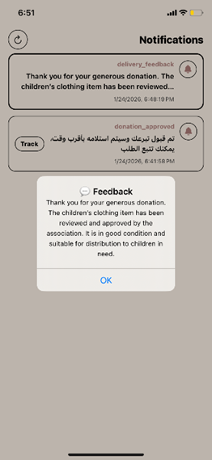
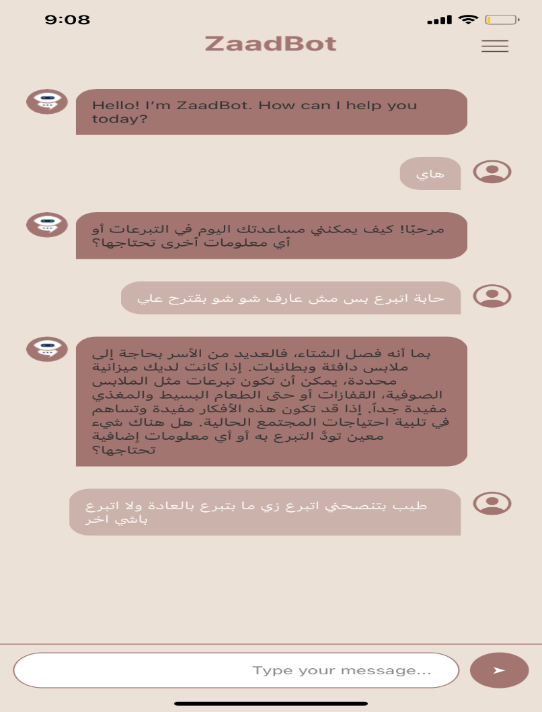
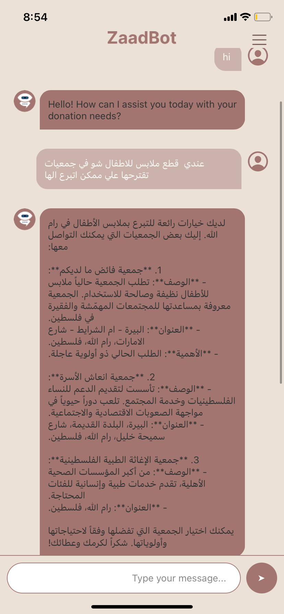
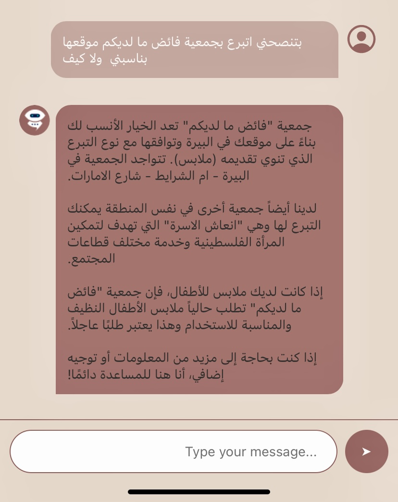

# Zaad Application

Zaad is a smart donation mobile application designed to simplify and organize the donation process by connecting donors with trusted charitable associations.  
The platform focuses mainly on food and clothing donations, helping donors donate easily while ensuring that donations reach the right organizations in a safe and organized way.

The application also integrates AI technologies to analyze donations, verify food quality, and assist in sorting donations efficiently.

---

## Features

- Donate food and clothing to verified charitable associations
- AI-based food validation (detect cooked vs packaged food, damaged items, and expiration dates)
- Barcode and OCR recognition to categorize donated products
- Smart chatbot that suggests suitable associations based on donation type and location
- Track donation status from submission until delivery
- Notification system for donation updates
- Reward points system to encourage continuous donations
- Associations can request specific donation items
- Feedback system between donors and associations

---

## Tech Stack

- **Frontend:** React Native (Expo)
- **Backend:** Node.js + Express.js
- **Database:** PostgreSQL
- **AI Models:** Python (TensorFlow, OpenCV)
- **APIs:** Google Cloud Vision API, OpenStreetMap Nominatim
- **Version Control:** Git & GitHub
- **Development Tools:** Visual Studio Code, Postman, Figma

# Zaad Application - Demo Screens

## Authentication (Login & Register)

  
  
  
  
  

---

## User Setup & Account

  
  
  
  

---

## Home & Navigation

  
  
  

---

## Food Donation Process (AI Validation)

  
  
  
  
  
  
  
  
  
  
  
  

---

## Clothes Donation Process

  
  

---

## Delivery & Tracking

  
  
  
  
  
  

---

## Notifications & Feedback

  
  
  
  
  

---

## AI Chatbot & Recommendations

  
  
  

---

## Association Dashboard

  
  
  
  
  
  
  
  
  

---

## Admin Dashboard

  
  

